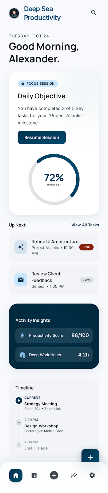
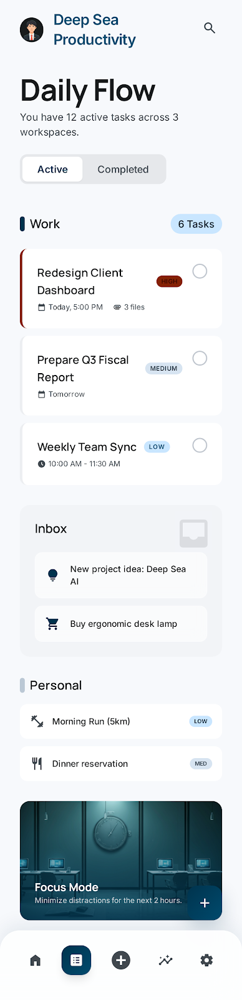
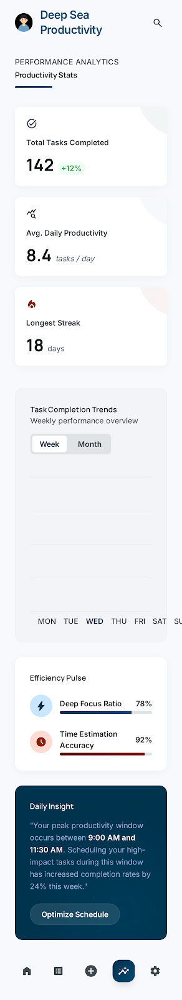

<p align="center">
  
</p>

<h1 align="center">ProductivityHub</h1>

<p align="center">
  <a href="https://github.com/gemraj29/ProductivityHub/actions/workflows/swift.yml">
    
  </a>
  
  
  
  
</p>

A modern iOS productivity app built with **SwiftUI** and **SwiftData**. Manage tasks, capture notes, track your calendar, and visualise your progress — all in one Deep Sea-themed workspace.

---

## Features

| Area | What you get |
|---|---|
| **Dashboard** | Personalised greeting, daily session progress ring, Up Next tasks, productivity score, deep-work hours, and calendar timeline |
| **Task Management** | Priority levels (Low → Urgent), workspaces (Inbox / Work / Personal), categories (Deep Work, Meetings, Admin), due-date reminders, overdue banner, Focus Mode |
| **Notes** | Rich text capture, pin-to-top, full-text search |
| **Calendar** | Month picker, day event list, create / delete events with colour coding |
| **Stats** | Total completed, longest streak, average daily tasks, 7-day bar chart (Swift Charts), efficiency pulse |
| **Settings** | Editable profile, Focus Mode toggle, workspace configuration |

---

## Screenshots

| Dashboard | Task List | Stats |
|:---:|:---:|:---:|
|  |  |  |

---

## Requirements

| Tool | Version |
|---|---|
| Xcode | **16.2 or later** |
| iOS target | **17.0 or later** |
| Swift | **5.10** |
| macOS (development) | **Sequoia 15+** |

> SwiftData and Swift Charts are used natively — no third-party dependencies required.

---

## Getting Started

### 1. Clone

```bash
git clone https://github.com/gemraj29/ProductivityHub.git
cd ProductivityHub
```

### 2. Open in Xcode

```bash
open ProductivityHub.xcodeproj
```

No additional setup needed — there are no Swift packages, no CocoaPods, no Homebrew tools.

### 3. Select a scheme and run

| Scheme | Target |
|---|---|
| `ProductivityHub` | Primary app target (iOS 17+, SwiftData) |
| `ProductivityHubTests` | Unit test target |

Select **ProductivityHub** → choose an iPhone 16 or later simulator → press **⌘R**.

---

## Building from the Command Line

```bash
# Build
xcodebuild build \
  -project ProductivityHub.xcodeproj \
  -scheme ProductivityHub \
  -destination "platform=iOS Simulator,OS=18.2,name=iPhone 16" \
  CODE_SIGNING_ALLOWED=NO

# Run tests
xcodebuild test \
  -project ProductivityHub.xcodeproj \
  -scheme ProductivityHub \
  -destination "platform=iOS Simulator,OS=18.2,name=iPhone 16" \
  CODE_SIGNING_ALLOWED=NO
```

Current test status: **42 tests, 0 failures**.

---

## Project Structure

```
ProductivityHub/
├── Sources/
│   ├── Assets.xcassets/          # App icon & future image assets
│   ├── CoreTypes.swift           # Shared enums (Priority, TaskWorkspace, etc.)
│   ├── Models.swift              # SwiftData @Model classes (TaskItem, NoteItem, …)
│   ├── RepositoryProtocols.swift # Protocol contracts for data layer
│   ├── Repositories.swift        # SwiftData-backed repository implementations
│   ├── Services.swift            # NotificationService, SearchService
│   ├── DependencyContainer.swift # Centralised DI / factory
│   ├── DesignSystem.swift        # Design tokens, shared components (DSCard, etc.)
│   ├── ProductivityHubApp.swift  # App entry point + root tab coordinator
│   ├── DashboardFeature.swift    # Home screen ViewModel + View
│   ├── TaskFeature.swift         # Task list & editor ViewModel + Views
│   ├── NoteFeature.swift         # Notes list & editor ViewModel + Views
│   ├── CalendarFeature.swift     # Calendar hub ViewModel + View
│   ├── StatsFeature.swift        # Statistics ViewModel + View
│   ├── SettingsFeature.swift     # Settings ViewModel + View
│   └── Compatibility.swift       # Compiler-version shims
├── Tests/
│   └── ProductivityHubTests.swift  # 42 unit tests (XCTest + Swift concurrency)
├── .github/
│   └── workflows/swift.yml         # GitHub Actions CI
├── assets/                          # README images
├── ARCHITECTURE.md
└── README.md
```

---

## Architecture

See [ARCHITECTURE.md](./ARCHITECTURE.md) for a full breakdown of layers, data flow, and design decisions.

**Quick summary:**

- **MVVM + Clean Architecture** — Views hold no business logic; ViewModels own state; Repositories abstract persistence.
- **DependencyContainer** — single `@MainActor` singleton wires everything; factory methods create ViewModels on demand.
- **SwiftData** — all models are `@Model` classes; `ModelContext` is injected into repositories; lightweight migration handled automatically.
- **Swift Concurrency** — all ViewModels are `@MainActor`; async work uses `async let` for parallelism and `.task {}` for lifecycle-bound fetches.

---

## CI/CD

Every push and pull request to `main` triggers the GitHub Actions workflow (`.github/workflows/swift.yml`):

1. **Build** — `xcodebuild build` on `macos-15` + Xcode 16.2 + iPhone 16 simulator
2. **Test** — `xcodebuild test` — all 42 tests must pass
3. **Artifact** — JUnit XML uploaded for every run (pass or fail)
4. **Concurrency** — stale runs cancelled automatically on new push

---

## License

Distributed under the MIT License. See `LICENSE` for more information.
