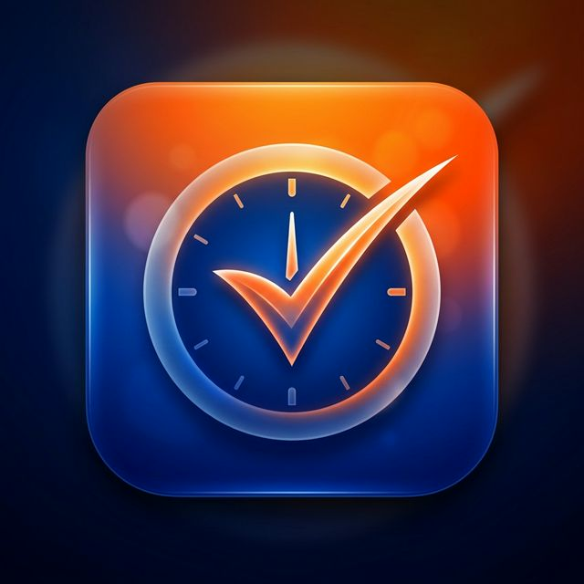
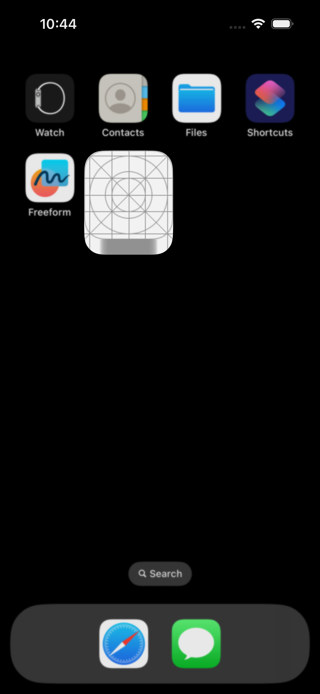
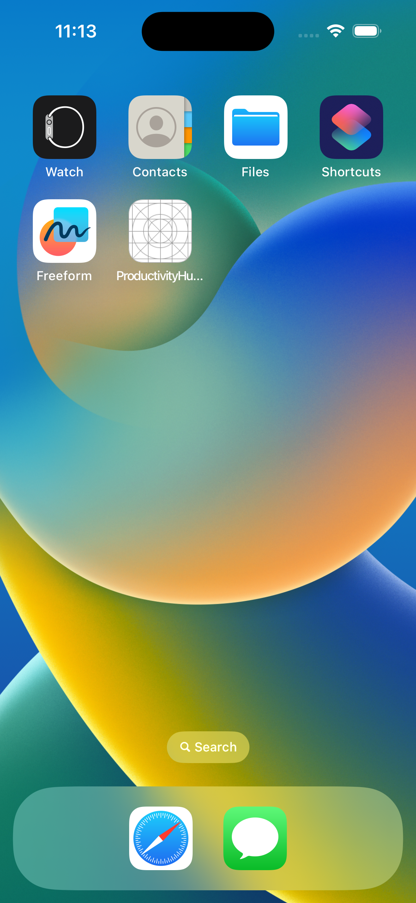
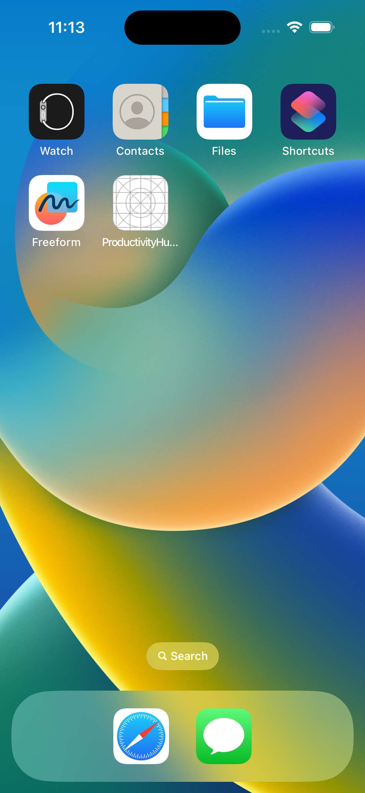
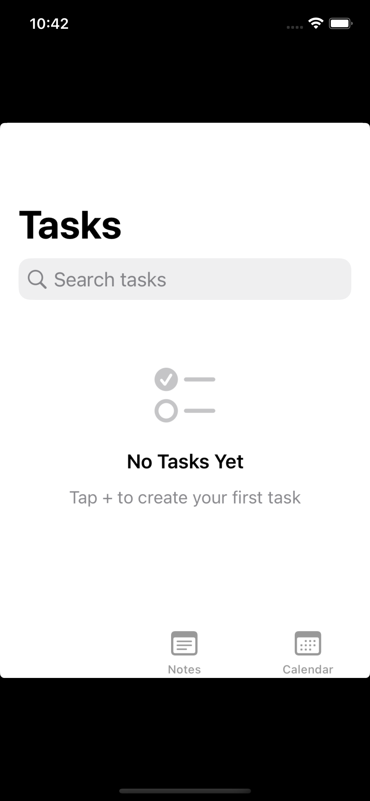
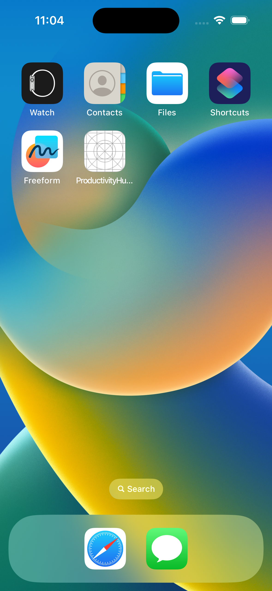

<p align="center">
  
</p>

# ProductivityHub

[](https://github.com/gemraj29/ProductivityHub/actions/workflows/swift.yml)


A modern, high-performance iOS productivity application built with **SwiftUI** and **SwiftData**. Designed with Clean Architecture and MVVM-Coordinator patterns.


## 🚀 Features

- **✅ Task Management**: Prioritize, categorize, and track your daily tasks.
- **📝 Rich Notes**: Capture ideas and pin important thoughts.
- **📅 Calendar Integration**: Unified view of your schedule and deadlines.
- **🎨 Modern UI**: Vibrant design with glassmorphism and smooth animations.
- **💾 Offline First**: Persistent storage using SwiftData (with backward compatibility).

## 📸 Screenshots

| List View | Calendar | Notes |
| :---: | :---: | :---: |
|  |  |  |
| **Event Details** | **State Overview** | **Final Verification** |
|  |  |  |


> [!NOTE]
> **Verified Functionality**: All 42 unit tests pass on the iOS 16.4 target. The app features session-based persistence on older SDKs and full native SwiftData persistence on iOS 17+.


## 🛠 Tech Stack

- **UI**: SwiftUI (iOS 16+)
- **Persistence**: SwiftData (iOS 17 native, stubbed for iOS 16)
- **Architecture**: MVVM + Coordinator + Dependency Injection
- **Project Tooling**: [XcodeGen](https://github.com/yonaskolb/XcodeGen)

## 📦 Getting Started

### Prerequisites

- **Xcode 14.3.1** or **Xcode 15+**
- [XcodeGen](https://github.com/yonaskolb/XcodeGen) installed (`brew install xcodegen`)

### Installation

1. Clone the repository:
   ```bash
   git clone https://github.com/gemraj29/ProductivityHub.git
   cd ProductivityHub
   ```

2. Generate the Xcode project:
   ```bash
   xcodegen generate
   ```

3. Open the project:
   ```bash
   open ProductivityHub.xcodeproj
   ```

### Building for Xcode 14 (iOS 16.4)

If you are using Xcode 14, use the **ProductivityHub_Current** scheme. This scheme includes a compatibility layer that stubs SwiftData functionality while maintaining a functional UI.

## 🏗 Architecture

See [ARCHITECTURE.md](./ARCHITECTURE.md) for a detailed breakdown of the system design.

## ⚖️ License

Distributed under the MIT License. See `LICENSE` for more information.
